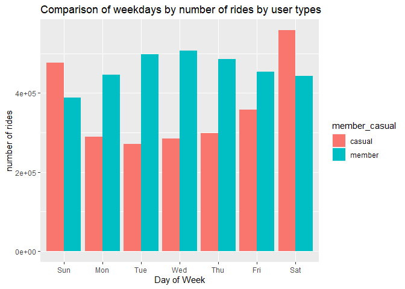
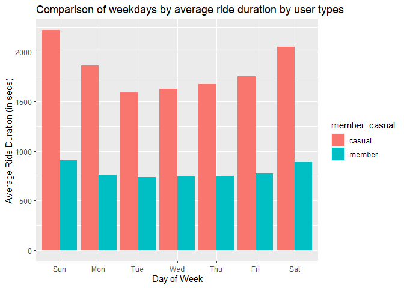
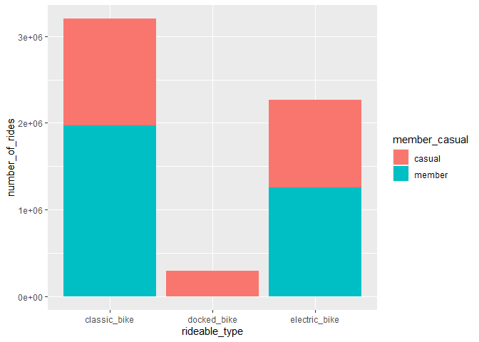

Cyclistic: Case Study
================

## **Introduction**

This analysis was done as an optional case study for the completion of
the Google Analytics Capstone Project Course, the final course for the
completion of the Googledata Analytics Certificate. It is originally
based on the case study “‘Sophisticated, Clear, and Polished’: Divvy and
Data Visualization” written by Kevin Hartman (found here:
<https://artscience.blog/home/divvy-dataviz-case-study>). The objective
is to analyze the divvy dataset of user ride data and answer the
question “In what ways do members and casual riders use Divvy bikes
differently?”

#### **Data Sources Used:**

The datasets used in this analysis have been made available by Motivate
Internation Inc. under this
[license](https://www.divvybikes.com/data-license-agreement).

[Source of data](https://divvy-tripdata.s3.amazonaws.com/index.html).

The data of the customers were gotten from here for the last 12 months
(april 2021 to may 2022)

#### **1.Loading Required libraries**

``` r
library(tidyverse)
```

    ## ── Attaching packages ─────────────────────────────────────── tidyverse 1.3.1 ──

    ## ✔ ggplot2 3.3.6     ✔ purrr   0.3.4
    ## ✔ tibble  3.1.7     ✔ dplyr   1.0.9
    ## ✔ tidyr   1.2.0     ✔ stringr 1.4.0
    ## ✔ readr   2.1.2     ✔ forcats 0.5.1

    ## ── Conflicts ────────────────────────────────────────── tidyverse_conflicts() ──
    ## ✖ dplyr::filter() masks stats::filter()
    ## ✖ dplyr::lag()    masks stats::lag()

``` r
library(lubridate)
```

    ## 
    ## Attaching package: 'lubridate'

    ## The following objects are masked from 'package:base':
    ## 
    ##     date, intersect, setdiff, union

``` r
library(ggplot2)
```

#### **2. Uploading all files**

``` r
##uploading files
may_2021<-read_csv("202105-divvy-tripdata.csv")
```

    ## Rows: 531633 Columns: 13
    ## ── Column specification ────────────────────────────────────────────────────────
    ## Delimiter: ","
    ## chr  (7): ride_id, rideable_type, start_station_name, start_station_id, end_...
    ## dbl  (4): start_lat, start_lng, end_lat, end_lng
    ## dttm (2): started_at, ended_at
    ## 
    ## ℹ Use `spec()` to retrieve the full column specification for this data.
    ## ℹ Specify the column types or set `show_col_types = FALSE` to quiet this message.

``` r
june_2021<-read_csv("202106-divvy-tripdata.csv")
```

    ## Rows: 729595 Columns: 13
    ## ── Column specification ────────────────────────────────────────────────────────
    ## Delimiter: ","
    ## chr  (7): ride_id, rideable_type, start_station_name, start_station_id, end_...
    ## dbl  (4): start_lat, start_lng, end_lat, end_lng
    ## dttm (2): started_at, ended_at
    ## 
    ## ℹ Use `spec()` to retrieve the full column specification for this data.
    ## ℹ Specify the column types or set `show_col_types = FALSE` to quiet this message.

``` r
july_2021<-read_csv("202107-divvy-tripdata.csv")
```

    ## Rows: 822410 Columns: 13
    ## ── Column specification ────────────────────────────────────────────────────────
    ## Delimiter: ","
    ## chr  (7): ride_id, rideable_type, start_station_name, start_station_id, end_...
    ## dbl  (4): start_lat, start_lng, end_lat, end_lng
    ## dttm (2): started_at, ended_at
    ## 
    ## ℹ Use `spec()` to retrieve the full column specification for this data.
    ## ℹ Specify the column types or set `show_col_types = FALSE` to quiet this message.

``` r
aug_2021<-read_csv("202108-divvy-tripdata.csv")
```

    ## Rows: 804352 Columns: 13
    ## ── Column specification ────────────────────────────────────────────────────────
    ## Delimiter: ","
    ## chr  (7): ride_id, rideable_type, start_station_name, start_station_id, end_...
    ## dbl  (4): start_lat, start_lng, end_lat, end_lng
    ## dttm (2): started_at, ended_at
    ## 
    ## ℹ Use `spec()` to retrieve the full column specification for this data.
    ## ℹ Specify the column types or set `show_col_types = FALSE` to quiet this message.

``` r
sept_2021<-read_csv("202109-divvy-tripdata.csv")
```

    ## Rows: 756147 Columns: 13
    ## ── Column specification ────────────────────────────────────────────────────────
    ## Delimiter: ","
    ## chr  (7): ride_id, rideable_type, start_station_name, start_station_id, end_...
    ## dbl  (4): start_lat, start_lng, end_lat, end_lng
    ## dttm (2): started_at, ended_at
    ## 
    ## ℹ Use `spec()` to retrieve the full column specification for this data.
    ## ℹ Specify the column types or set `show_col_types = FALSE` to quiet this message.

``` r
oct_2021<-read_csv("202110-divvy-tripdata.csv")
```

    ## Rows: 631226 Columns: 13
    ## ── Column specification ────────────────────────────────────────────────────────
    ## Delimiter: ","
    ## chr  (7): ride_id, rideable_type, start_station_name, start_station_id, end_...
    ## dbl  (4): start_lat, start_lng, end_lat, end_lng
    ## dttm (2): started_at, ended_at
    ## 
    ## ℹ Use `spec()` to retrieve the full column specification for this data.
    ## ℹ Specify the column types or set `show_col_types = FALSE` to quiet this message.

``` r
nov_2021<-read_csv("202111-divvy-tripdata.csv")
```

    ## Rows: 359978 Columns: 13
    ## ── Column specification ────────────────────────────────────────────────────────
    ## Delimiter: ","
    ## chr  (7): ride_id, rideable_type, start_station_name, start_station_id, end_...
    ## dbl  (4): start_lat, start_lng, end_lat, end_lng
    ## dttm (2): started_at, ended_at
    ## 
    ## ℹ Use `spec()` to retrieve the full column specification for this data.
    ## ℹ Specify the column types or set `show_col_types = FALSE` to quiet this message.

``` r
dec_2021<-read_csv("202112-divvy-tripdata.csv")
```

    ## Rows: 247540 Columns: 13
    ## ── Column specification ────────────────────────────────────────────────────────
    ## Delimiter: ","
    ## chr  (7): ride_id, rideable_type, start_station_name, start_station_id, end_...
    ## dbl  (4): start_lat, start_lng, end_lat, end_lng
    ## dttm (2): started_at, ended_at
    ## 
    ## ℹ Use `spec()` to retrieve the full column specification for this data.
    ## ℹ Specify the column types or set `show_col_types = FALSE` to quiet this message.

``` r
jan_2022<-read_csv("202201-divvy-tripdata.csv")
```

    ## Rows: 103770 Columns: 13
    ## ── Column specification ────────────────────────────────────────────────────────
    ## Delimiter: ","
    ## chr  (7): ride_id, rideable_type, start_station_name, start_station_id, end_...
    ## dbl  (4): start_lat, start_lng, end_lat, end_lng
    ## dttm (2): started_at, ended_at
    ## 
    ## ℹ Use `spec()` to retrieve the full column specification for this data.
    ## ℹ Specify the column types or set `show_col_types = FALSE` to quiet this message.

``` r
feb_2022<-read_csv("202202-divvy-tripdata.csv")
```

    ## Rows: 115609 Columns: 13
    ## ── Column specification ────────────────────────────────────────────────────────
    ## Delimiter: ","
    ## chr  (7): ride_id, rideable_type, start_station_name, start_station_id, end_...
    ## dbl  (4): start_lat, start_lng, end_lat, end_lng
    ## dttm (2): started_at, ended_at
    ## 
    ## ℹ Use `spec()` to retrieve the full column specification for this data.
    ## ℹ Specify the column types or set `show_col_types = FALSE` to quiet this message.

``` r
mar_2022<-read_csv("202203-divvy-tripdata.csv")
```

    ## Rows: 284042 Columns: 13
    ## ── Column specification ────────────────────────────────────────────────────────
    ## Delimiter: ","
    ## chr  (7): ride_id, rideable_type, start_station_name, start_station_id, end_...
    ## dbl  (4): start_lat, start_lng, end_lat, end_lng
    ## dttm (2): started_at, ended_at
    ## 
    ## ℹ Use `spec()` to retrieve the full column specification for this data.
    ## ℹ Specify the column types or set `show_col_types = FALSE` to quiet this message.

``` r
apr_2022<-read_csv("202204-divvy-tripdata.csv")
```

    ## Rows: 371249 Columns: 13
    ## ── Column specification ────────────────────────────────────────────────────────
    ## Delimiter: ","
    ## chr  (7): ride_id, rideable_type, start_station_name, start_station_id, end_...
    ## dbl  (4): start_lat, start_lng, end_lat, end_lng
    ## dttm (2): started_at, ended_at
    ## 
    ## ℹ Use `spec()` to retrieve the full column specification for this data.
    ## ℹ Specify the column types or set `show_col_types = FALSE` to quiet this message.

#### **3. Inspecting Data and joining into one data frame**

``` r
# inspecting dataframes to check that they are consistent before joining
str(may_2021)
```

    ## spec_tbl_df [531,633 × 13] (S3: spec_tbl_df/tbl_df/tbl/data.frame)
    ##  $ ride_id           : chr [1:531633] "C809ED75D6160B2A" "DD59FDCE0ACACAF3" "0AB83CB88C43EFC2" "7881AC6D39110C60" ...
    ##  $ rideable_type     : chr [1:531633] "electric_bike" "electric_bike" "electric_bike" "electric_bike" ...
    ##  $ started_at        : POSIXct[1:531633], format: "2021-05-30 11:58:15" "2021-05-30 11:29:14" ...
    ##  $ ended_at          : POSIXct[1:531633], format: "2021-05-30 12:10:39" "2021-05-30 12:14:09" ...
    ##  $ start_station_name: chr [1:531633] NA NA NA NA ...
    ##  $ start_station_id  : chr [1:531633] NA NA NA NA ...
    ##  $ end_station_name  : chr [1:531633] NA NA NA NA ...
    ##  $ end_station_id    : chr [1:531633] NA NA NA NA ...
    ##  $ start_lat         : num [1:531633] 41.9 41.9 41.9 41.9 41.9 ...
    ##  $ start_lng         : num [1:531633] -87.6 -87.6 -87.7 -87.7 -87.7 ...
    ##  $ end_lat           : num [1:531633] 41.9 41.8 41.9 41.9 41.9 ...
    ##  $ end_lng           : num [1:531633] -87.6 -87.6 -87.7 -87.7 -87.7 ...
    ##  $ member_casual     : chr [1:531633] "casual" "casual" "casual" "casual" ...
    ##  - attr(*, "spec")=
    ##   .. cols(
    ##   ..   ride_id = col_character(),
    ##   ..   rideable_type = col_character(),
    ##   ..   started_at = col_datetime(format = ""),
    ##   ..   ended_at = col_datetime(format = ""),
    ##   ..   start_station_name = col_character(),
    ##   ..   start_station_id = col_character(),
    ##   ..   end_station_name = col_character(),
    ##   ..   end_station_id = col_character(),
    ##   ..   start_lat = col_double(),
    ##   ..   start_lng = col_double(),
    ##   ..   end_lat = col_double(),
    ##   ..   end_lng = col_double(),
    ##   ..   member_casual = col_character()
    ##   .. )
    ##  - attr(*, "problems")=<externalptr>

``` r
str(june_2021)
```

    ## spec_tbl_df [729,595 × 13] (S3: spec_tbl_df/tbl_df/tbl/data.frame)
    ##  $ ride_id           : chr [1:729595] "99FEC93BA843FB20" "06048DCFC8520CAF" "9598066F68045DF2" "B03C0FE48C412214" ...
    ##  $ rideable_type     : chr [1:729595] "electric_bike" "electric_bike" "electric_bike" "electric_bike" ...
    ##  $ started_at        : POSIXct[1:729595], format: "2021-06-13 14:31:28" "2021-06-04 11:18:02" ...
    ##  $ ended_at          : POSIXct[1:729595], format: "2021-06-13 14:34:11" "2021-06-04 11:24:19" ...
    ##  $ start_station_name: chr [1:729595] NA NA NA NA ...
    ##  $ start_station_id  : chr [1:729595] NA NA NA NA ...
    ##  $ end_station_name  : chr [1:729595] NA NA NA NA ...
    ##  $ end_station_id    : chr [1:729595] NA NA NA NA ...
    ##  $ start_lat         : num [1:729595] 41.8 41.8 41.8 41.8 41.8 ...
    ##  $ start_lng         : num [1:729595] -87.6 -87.6 -87.6 -87.6 -87.6 ...
    ##  $ end_lat           : num [1:729595] 41.8 41.8 41.8 41.8 41.8 ...
    ##  $ end_lng           : num [1:729595] -87.6 -87.6 -87.6 -87.6 -87.6 ...
    ##  $ member_casual     : chr [1:729595] "member" "member" "member" "member" ...
    ##  - attr(*, "spec")=
    ##   .. cols(
    ##   ..   ride_id = col_character(),
    ##   ..   rideable_type = col_character(),
    ##   ..   started_at = col_datetime(format = ""),
    ##   ..   ended_at = col_datetime(format = ""),
    ##   ..   start_station_name = col_character(),
    ##   ..   start_station_id = col_character(),
    ##   ..   end_station_name = col_character(),
    ##   ..   end_station_id = col_character(),
    ##   ..   start_lat = col_double(),
    ##   ..   start_lng = col_double(),
    ##   ..   end_lat = col_double(),
    ##   ..   end_lng = col_double(),
    ##   ..   member_casual = col_character()
    ##   .. )
    ##  - attr(*, "problems")=<externalptr>

``` r
str(july_2021)
```

    ## spec_tbl_df [822,410 × 13] (S3: spec_tbl_df/tbl_df/tbl/data.frame)
    ##  $ ride_id           : chr [1:822410] "0A1B623926EF4E16" "B2D5583A5A5E76EE" "6F264597DDBF427A" "379B58EAB20E8AA5" ...
    ##  $ rideable_type     : chr [1:822410] "docked_bike" "classic_bike" "classic_bike" "classic_bike" ...
    ##  $ started_at        : POSIXct[1:822410], format: "2021-07-02 14:44:36" "2021-07-07 16:57:42" ...
    ##  $ ended_at          : POSIXct[1:822410], format: "2021-07-02 15:19:58" "2021-07-07 17:16:09" ...
    ##  $ start_station_name: chr [1:822410] "Michigan Ave & Washington St" "California Ave & Cortez St" "Wabash Ave & 16th St" "California Ave & Cortez St" ...
    ##  $ start_station_id  : chr [1:822410] "13001" "17660" "SL-012" "17660" ...
    ##  $ end_station_name  : chr [1:822410] "Halsted St & North Branch St" "Wood St & Hubbard St" "Rush St & Hubbard St" "Carpenter St & Huron St" ...
    ##  $ end_station_id    : chr [1:822410] "KA1504000117" "13432" "KA1503000044" "13196" ...
    ##  $ start_lat         : num [1:822410] 41.9 41.9 41.9 41.9 41.9 ...
    ##  $ start_lng         : num [1:822410] -87.6 -87.7 -87.6 -87.7 -87.7 ...
    ##  $ end_lat           : num [1:822410] 41.9 41.9 41.9 41.9 41.9 ...
    ##  $ end_lng           : num [1:822410] -87.6 -87.7 -87.6 -87.7 -87.7 ...
    ##  $ member_casual     : chr [1:822410] "casual" "casual" "member" "member" ...
    ##  - attr(*, "spec")=
    ##   .. cols(
    ##   ..   ride_id = col_character(),
    ##   ..   rideable_type = col_character(),
    ##   ..   started_at = col_datetime(format = ""),
    ##   ..   ended_at = col_datetime(format = ""),
    ##   ..   start_station_name = col_character(),
    ##   ..   start_station_id = col_character(),
    ##   ..   end_station_name = col_character(),
    ##   ..   end_station_id = col_character(),
    ##   ..   start_lat = col_double(),
    ##   ..   start_lng = col_double(),
    ##   ..   end_lat = col_double(),
    ##   ..   end_lng = col_double(),
    ##   ..   member_casual = col_character()
    ##   .. )
    ##  - attr(*, "problems")=<externalptr>

``` r
str(aug_2021)
```

    ## spec_tbl_df [804,352 × 13] (S3: spec_tbl_df/tbl_df/tbl/data.frame)
    ##  $ ride_id           : chr [1:804352] "99103BB87CC6C1BB" "EAFCCCFB0A3FC5A1" "9EF4F46C57AD234D" "5834D3208BFAF1DA" ...
    ##  $ rideable_type     : chr [1:804352] "electric_bike" "electric_bike" "electric_bike" "electric_bike" ...
    ##  $ started_at        : POSIXct[1:804352], format: "2021-08-10 17:15:49" "2021-08-10 17:23:14" ...
    ##  $ ended_at          : POSIXct[1:804352], format: "2021-08-10 17:22:44" "2021-08-10 17:39:24" ...
    ##  $ start_station_name: chr [1:804352] NA NA NA NA ...
    ##  $ start_station_id  : chr [1:804352] NA NA NA NA ...
    ##  $ end_station_name  : chr [1:804352] NA NA NA NA ...
    ##  $ end_station_id    : chr [1:804352] NA NA NA NA ...
    ##  $ start_lat         : num [1:804352] 41.8 41.8 42 42 41.8 ...
    ##  $ start_lng         : num [1:804352] -87.7 -87.7 -87.7 -87.7 -87.6 ...
    ##  $ end_lat           : num [1:804352] 41.8 41.8 42 42 41.8 ...
    ##  $ end_lng           : num [1:804352] -87.7 -87.6 -87.7 -87.7 -87.6 ...
    ##  $ member_casual     : chr [1:804352] "member" "member" "member" "member" ...
    ##  - attr(*, "spec")=
    ##   .. cols(
    ##   ..   ride_id = col_character(),
    ##   ..   rideable_type = col_character(),
    ##   ..   started_at = col_datetime(format = ""),
    ##   ..   ended_at = col_datetime(format = ""),
    ##   ..   start_station_name = col_character(),
    ##   ..   start_station_id = col_character(),
    ##   ..   end_station_name = col_character(),
    ##   ..   end_station_id = col_character(),
    ##   ..   start_lat = col_double(),
    ##   ..   start_lng = col_double(),
    ##   ..   end_lat = col_double(),
    ##   ..   end_lng = col_double(),
    ##   ..   member_casual = col_character()
    ##   .. )
    ##  - attr(*, "problems")=<externalptr>

``` r
str(sept_2021)
```

    ## spec_tbl_df [756,147 × 13] (S3: spec_tbl_df/tbl_df/tbl/data.frame)
    ##  $ ride_id           : chr [1:756147] "9DC7B962304CBFD8" "F930E2C6872D6B32" "6EF72137900BB910" "78D1DE133B3DBF55" ...
    ##  $ rideable_type     : chr [1:756147] "electric_bike" "electric_bike" "electric_bike" "electric_bike" ...
    ##  $ started_at        : POSIXct[1:756147], format: "2021-09-28 16:07:10" "2021-09-28 14:24:51" ...
    ##  $ ended_at          : POSIXct[1:756147], format: "2021-09-28 16:09:54" "2021-09-28 14:40:05" ...
    ##  $ start_station_name: chr [1:756147] NA NA NA NA ...
    ##  $ start_station_id  : chr [1:756147] NA NA NA NA ...
    ##  $ end_station_name  : chr [1:756147] NA NA NA NA ...
    ##  $ end_station_id    : chr [1:756147] NA NA NA NA ...
    ##  $ start_lat         : num [1:756147] 41.9 41.9 41.8 41.8 41.9 ...
    ##  $ start_lng         : num [1:756147] -87.7 -87.6 -87.7 -87.7 -87.7 ...
    ##  $ end_lat           : num [1:756147] 41.9 42 41.8 41.8 41.9 ...
    ##  $ end_lng           : num [1:756147] -87.7 -87.7 -87.7 -87.7 -87.7 ...
    ##  $ member_casual     : chr [1:756147] "casual" "casual" "casual" "casual" ...
    ##  - attr(*, "spec")=
    ##   .. cols(
    ##   ..   ride_id = col_character(),
    ##   ..   rideable_type = col_character(),
    ##   ..   started_at = col_datetime(format = ""),
    ##   ..   ended_at = col_datetime(format = ""),
    ##   ..   start_station_name = col_character(),
    ##   ..   start_station_id = col_character(),
    ##   ..   end_station_name = col_character(),
    ##   ..   end_station_id = col_character(),
    ##   ..   start_lat = col_double(),
    ##   ..   start_lng = col_double(),
    ##   ..   end_lat = col_double(),
    ##   ..   end_lng = col_double(),
    ##   ..   member_casual = col_character()
    ##   .. )
    ##  - attr(*, "problems")=<externalptr>

``` r
str(oct_2021)
```

    ## spec_tbl_df [631,226 × 13] (S3: spec_tbl_df/tbl_df/tbl/data.frame)
    ##  $ ride_id           : chr [1:631226] "620BC6107255BF4C" "4471C70731AB2E45" "26CA69D43D15EE14" "362947F0437E1514" ...
    ##  $ rideable_type     : chr [1:631226] "electric_bike" "electric_bike" "electric_bike" "electric_bike" ...
    ##  $ started_at        : POSIXct[1:631226], format: "2021-10-22 12:46:42" "2021-10-21 09:12:37" ...
    ##  $ ended_at          : POSIXct[1:631226], format: "2021-10-22 12:49:50" "2021-10-21 09:14:14" ...
    ##  $ start_station_name: chr [1:631226] "Kingsbury St & Kinzie St" NA NA NA ...
    ##  $ start_station_id  : chr [1:631226] "KA1503000043" NA NA NA ...
    ##  $ end_station_name  : chr [1:631226] NA NA NA NA ...
    ##  $ end_station_id    : chr [1:631226] NA NA NA NA ...
    ##  $ start_lat         : num [1:631226] 41.9 41.9 41.9 41.9 41.9 ...
    ##  $ start_lng         : num [1:631226] -87.6 -87.7 -87.7 -87.7 -87.7 ...
    ##  $ end_lat           : num [1:631226] 41.9 41.9 41.9 41.9 41.9 ...
    ##  $ end_lng           : num [1:631226] -87.6 -87.7 -87.7 -87.7 -87.7 ...
    ##  $ member_casual     : chr [1:631226] "member" "member" "member" "member" ...
    ##  - attr(*, "spec")=
    ##   .. cols(
    ##   ..   ride_id = col_character(),
    ##   ..   rideable_type = col_character(),
    ##   ..   started_at = col_datetime(format = ""),
    ##   ..   ended_at = col_datetime(format = ""),
    ##   ..   start_station_name = col_character(),
    ##   ..   start_station_id = col_character(),
    ##   ..   end_station_name = col_character(),
    ##   ..   end_station_id = col_character(),
    ##   ..   start_lat = col_double(),
    ##   ..   start_lng = col_double(),
    ##   ..   end_lat = col_double(),
    ##   ..   end_lng = col_double(),
    ##   ..   member_casual = col_character()
    ##   .. )
    ##  - attr(*, "problems")=<externalptr>

``` r
str(nov_2021)
```

    ## spec_tbl_df [359,978 × 13] (S3: spec_tbl_df/tbl_df/tbl/data.frame)
    ##  $ ride_id           : chr [1:359978] "7C00A93E10556E47" "90854840DFD508BA" "0A7D10CDD144061C" "2F3BE33085BCFF02" ...
    ##  $ rideable_type     : chr [1:359978] "electric_bike" "electric_bike" "electric_bike" "electric_bike" ...
    ##  $ started_at        : POSIXct[1:359978], format: "2021-11-27 13:27:38" "2021-11-27 13:38:25" ...
    ##  $ ended_at          : POSIXct[1:359978], format: "2021-11-27 13:46:38" "2021-11-27 13:56:10" ...
    ##  $ start_station_name: chr [1:359978] NA NA NA NA ...
    ##  $ start_station_id  : chr [1:359978] NA NA NA NA ...
    ##  $ end_station_name  : chr [1:359978] NA NA NA NA ...
    ##  $ end_station_id    : chr [1:359978] NA NA NA NA ...
    ##  $ start_lat         : num [1:359978] 41.9 42 42 41.9 41.9 ...
    ##  $ start_lng         : num [1:359978] -87.7 -87.7 -87.7 -87.8 -87.6 ...
    ##  $ end_lat           : num [1:359978] 42 41.9 42 41.9 41.9 ...
    ##  $ end_lng           : num [1:359978] -87.7 -87.7 -87.7 -87.8 -87.6 ...
    ##  $ member_casual     : chr [1:359978] "casual" "casual" "casual" "casual" ...
    ##  - attr(*, "spec")=
    ##   .. cols(
    ##   ..   ride_id = col_character(),
    ##   ..   rideable_type = col_character(),
    ##   ..   started_at = col_datetime(format = ""),
    ##   ..   ended_at = col_datetime(format = ""),
    ##   ..   start_station_name = col_character(),
    ##   ..   start_station_id = col_character(),
    ##   ..   end_station_name = col_character(),
    ##   ..   end_station_id = col_character(),
    ##   ..   start_lat = col_double(),
    ##   ..   start_lng = col_double(),
    ##   ..   end_lat = col_double(),
    ##   ..   end_lng = col_double(),
    ##   ..   member_casual = col_character()
    ##   .. )
    ##  - attr(*, "problems")=<externalptr>

``` r
str(dec_2021)
```

    ## spec_tbl_df [247,540 × 13] (S3: spec_tbl_df/tbl_df/tbl/data.frame)
    ##  $ ride_id           : chr [1:247540] "46F8167220E4431F" "73A77762838B32FD" "4CF42452054F59C5" "3278BA87BF698339" ...
    ##  $ rideable_type     : chr [1:247540] "electric_bike" "electric_bike" "electric_bike" "classic_bike" ...
    ##  $ started_at        : POSIXct[1:247540], format: "2021-12-07 15:06:07" "2021-12-11 03:43:29" ...
    ##  $ ended_at          : POSIXct[1:247540], format: "2021-12-07 15:13:42" "2021-12-11 04:10:23" ...
    ##  $ start_station_name: chr [1:247540] "Laflin St & Cullerton St" "LaSalle Dr & Huron St" "Halsted St & North Branch St" "Halsted St & North Branch St" ...
    ##  $ start_station_id  : chr [1:247540] "13307" "KP1705001026" "KA1504000117" "KA1504000117" ...
    ##  $ end_station_name  : chr [1:247540] "Morgan St & Polk St" "Clarendon Ave & Leland Ave" "Broadway & Barry Ave" "LaSalle Dr & Huron St" ...
    ##  $ end_station_id    : chr [1:247540] "TA1307000130" "TA1307000119" "13137" "KP1705001026" ...
    ##  $ start_lat         : num [1:247540] 41.9 41.9 41.9 41.9 41.9 ...
    ##  $ start_lng         : num [1:247540] -87.7 -87.6 -87.6 -87.6 -87.7 ...
    ##  $ end_lat           : num [1:247540] 41.9 42 41.9 41.9 41.9 ...
    ##  $ end_lng           : num [1:247540] -87.7 -87.7 -87.6 -87.6 -87.6 ...
    ##  $ member_casual     : chr [1:247540] "member" "casual" "member" "member" ...
    ##  - attr(*, "spec")=
    ##   .. cols(
    ##   ..   ride_id = col_character(),
    ##   ..   rideable_type = col_character(),
    ##   ..   started_at = col_datetime(format = ""),
    ##   ..   ended_at = col_datetime(format = ""),
    ##   ..   start_station_name = col_character(),
    ##   ..   start_station_id = col_character(),
    ##   ..   end_station_name = col_character(),
    ##   ..   end_station_id = col_character(),
    ##   ..   start_lat = col_double(),
    ##   ..   start_lng = col_double(),
    ##   ..   end_lat = col_double(),
    ##   ..   end_lng = col_double(),
    ##   ..   member_casual = col_character()
    ##   .. )
    ##  - attr(*, "problems")=<externalptr>

``` r
str(jan_2022)
```

    ## spec_tbl_df [103,770 × 13] (S3: spec_tbl_df/tbl_df/tbl/data.frame)
    ##  $ ride_id           : chr [1:103770] "C2F7DD78E82EC875" "A6CF8980A652D272" "BD0F91DFF741C66D" "CBB80ED419105406" ...
    ##  $ rideable_type     : chr [1:103770] "electric_bike" "electric_bike" "classic_bike" "classic_bike" ...
    ##  $ started_at        : POSIXct[1:103770], format: "2022-01-13 11:59:47" "2022-01-10 08:41:56" ...
    ##  $ ended_at          : POSIXct[1:103770], format: "2022-01-13 12:02:44" "2022-01-10 08:46:17" ...
    ##  $ start_station_name: chr [1:103770] "Glenwood Ave & Touhy Ave" "Glenwood Ave & Touhy Ave" "Sheffield Ave & Fullerton Ave" "Clark St & Bryn Mawr Ave" ...
    ##  $ start_station_id  : chr [1:103770] "525" "525" "TA1306000016" "KA1504000151" ...
    ##  $ end_station_name  : chr [1:103770] "Clark St & Touhy Ave" "Clark St & Touhy Ave" "Greenview Ave & Fullerton Ave" "Paulina St & Montrose Ave" ...
    ##  $ end_station_id    : chr [1:103770] "RP-007" "RP-007" "TA1307000001" "TA1309000021" ...
    ##  $ start_lat         : num [1:103770] 42 42 41.9 42 41.9 ...
    ##  $ start_lng         : num [1:103770] -87.7 -87.7 -87.7 -87.7 -87.6 ...
    ##  $ end_lat           : num [1:103770] 42 42 41.9 42 41.9 ...
    ##  $ end_lng           : num [1:103770] -87.7 -87.7 -87.7 -87.7 -87.6 ...
    ##  $ member_casual     : chr [1:103770] "casual" "casual" "member" "casual" ...
    ##  - attr(*, "spec")=
    ##   .. cols(
    ##   ..   ride_id = col_character(),
    ##   ..   rideable_type = col_character(),
    ##   ..   started_at = col_datetime(format = ""),
    ##   ..   ended_at = col_datetime(format = ""),
    ##   ..   start_station_name = col_character(),
    ##   ..   start_station_id = col_character(),
    ##   ..   end_station_name = col_character(),
    ##   ..   end_station_id = col_character(),
    ##   ..   start_lat = col_double(),
    ##   ..   start_lng = col_double(),
    ##   ..   end_lat = col_double(),
    ##   ..   end_lng = col_double(),
    ##   ..   member_casual = col_character()
    ##   .. )
    ##  - attr(*, "problems")=<externalptr>

``` r
str(feb_2022)
```

    ## spec_tbl_df [115,609 × 13] (S3: spec_tbl_df/tbl_df/tbl/data.frame)
    ##  $ ride_id           : chr [1:115609] "E1E065E7ED285C02" "1602DCDC5B30FFE3" "BE7DD2AF4B55C4AF" "A1789BDF844412BE" ...
    ##  $ rideable_type     : chr [1:115609] "classic_bike" "classic_bike" "classic_bike" "classic_bike" ...
    ##  $ started_at        : POSIXct[1:115609], format: "2022-02-19 18:08:41" "2022-02-20 17:41:30" ...
    ##  $ ended_at          : POSIXct[1:115609], format: "2022-02-19 18:23:56" "2022-02-20 17:45:56" ...
    ##  $ start_station_name: chr [1:115609] "State St & Randolph St" "Halsted St & Wrightwood Ave" "State St & Randolph St" "Southport Ave & Waveland Ave" ...
    ##  $ start_station_id  : chr [1:115609] "TA1305000029" "TA1309000061" "TA1305000029" "13235" ...
    ##  $ end_station_name  : chr [1:115609] "Clark St & Lincoln Ave" "Southport Ave & Wrightwood Ave" "Canal St & Adams St" "Broadway & Sheridan Rd" ...
    ##  $ end_station_id    : chr [1:115609] "13179" "TA1307000113" "13011" "13323" ...
    ##  $ start_lat         : num [1:115609] 41.9 41.9 41.9 41.9 41.9 ...
    ##  $ start_lng         : num [1:115609] -87.6 -87.6 -87.6 -87.7 -87.6 ...
    ##  $ end_lat           : num [1:115609] 41.9 41.9 41.9 42 41.9 ...
    ##  $ end_lng           : num [1:115609] -87.6 -87.7 -87.6 -87.6 -87.6 ...
    ##  $ member_casual     : chr [1:115609] "member" "member" "member" "member" ...
    ##  - attr(*, "spec")=
    ##   .. cols(
    ##   ..   ride_id = col_character(),
    ##   ..   rideable_type = col_character(),
    ##   ..   started_at = col_datetime(format = ""),
    ##   ..   ended_at = col_datetime(format = ""),
    ##   ..   start_station_name = col_character(),
    ##   ..   start_station_id = col_character(),
    ##   ..   end_station_name = col_character(),
    ##   ..   end_station_id = col_character(),
    ##   ..   start_lat = col_double(),
    ##   ..   start_lng = col_double(),
    ##   ..   end_lat = col_double(),
    ##   ..   end_lng = col_double(),
    ##   ..   member_casual = col_character()
    ##   .. )
    ##  - attr(*, "problems")=<externalptr>

``` r
str(mar_2022)
```

    ## spec_tbl_df [284,042 × 13] (S3: spec_tbl_df/tbl_df/tbl/data.frame)
    ##  $ ride_id           : chr [1:284042] "47EC0A7F82E65D52" "8494861979B0F477" "EFE527AF80B66109" "9F446FD9DEE3F389" ...
    ##  $ rideable_type     : chr [1:284042] "classic_bike" "electric_bike" "classic_bike" "classic_bike" ...
    ##  $ started_at        : POSIXct[1:284042], format: "2022-03-21 13:45:01" "2022-03-16 09:37:16" ...
    ##  $ ended_at          : POSIXct[1:284042], format: "2022-03-21 13:51:18" "2022-03-16 09:43:34" ...
    ##  $ start_station_name: chr [1:284042] "Wabash Ave & Wacker Pl" "Michigan Ave & Oak St" "Broadway & Berwyn Ave" "Wabash Ave & Wacker Pl" ...
    ##  $ start_station_id  : chr [1:284042] "TA1307000131" "13042" "13109" "TA1307000131" ...
    ##  $ end_station_name  : chr [1:284042] "Kingsbury St & Kinzie St" "Orleans St & Chestnut St (NEXT Apts)" "Broadway & Ridge Ave" "Franklin St & Jackson Blvd" ...
    ##  $ end_station_id    : chr [1:284042] "KA1503000043" "620" "15578" "TA1305000025" ...
    ##  $ start_lat         : num [1:284042] 41.9 41.9 42 41.9 41.9 ...
    ##  $ start_lng         : num [1:284042] -87.6 -87.6 -87.7 -87.6 -87.6 ...
    ##  $ end_lat           : num [1:284042] 41.9 41.9 42 41.9 41.9 ...
    ##  $ end_lng           : num [1:284042] -87.6 -87.6 -87.7 -87.6 -87.7 ...
    ##  $ member_casual     : chr [1:284042] "member" "member" "member" "member" ...
    ##  - attr(*, "spec")=
    ##   .. cols(
    ##   ..   ride_id = col_character(),
    ##   ..   rideable_type = col_character(),
    ##   ..   started_at = col_datetime(format = ""),
    ##   ..   ended_at = col_datetime(format = ""),
    ##   ..   start_station_name = col_character(),
    ##   ..   start_station_id = col_character(),
    ##   ..   end_station_name = col_character(),
    ##   ..   end_station_id = col_character(),
    ##   ..   start_lat = col_double(),
    ##   ..   start_lng = col_double(),
    ##   ..   end_lat = col_double(),
    ##   ..   end_lng = col_double(),
    ##   ..   member_casual = col_character()
    ##   .. )
    ##  - attr(*, "problems")=<externalptr>

``` r
str(apr_2022)
```

    ## spec_tbl_df [371,249 × 13] (S3: spec_tbl_df/tbl_df/tbl/data.frame)
    ##  $ ride_id           : chr [1:371249] "3564070EEFD12711" "0B820C7FCF22F489" "89EEEE32293F07FF" "84D4751AEB31888D" ...
    ##  $ rideable_type     : chr [1:371249] "electric_bike" "classic_bike" "classic_bike" "classic_bike" ...
    ##  $ started_at        : POSIXct[1:371249], format: "2022-04-06 17:42:48" "2022-04-24 19:23:07" ...
    ##  $ ended_at          : POSIXct[1:371249], format: "2022-04-06 17:54:36" "2022-04-24 19:43:17" ...
    ##  $ start_station_name: chr [1:371249] "Paulina St & Howard St" "Wentworth Ave & Cermak Rd" "Halsted St & Polk St" "Wentworth Ave & Cermak Rd" ...
    ##  $ start_station_id  : chr [1:371249] "515" "13075" "TA1307000121" "13075" ...
    ##  $ end_station_name  : chr [1:371249] "University Library (NU)" "Green St & Madison St" "Green St & Madison St" "Delano Ct & Roosevelt Rd" ...
    ##  $ end_station_id    : chr [1:371249] "605" "TA1307000120" "TA1307000120" "KA1706005007" ...
    ##  $ start_lat         : num [1:371249] 42 41.9 41.9 41.9 41.9 ...
    ##  $ start_lng         : num [1:371249] -87.7 -87.6 -87.6 -87.6 -87.6 ...
    ##  $ end_lat           : num [1:371249] 42.1 41.9 41.9 41.9 41.9 ...
    ##  $ end_lng           : num [1:371249] -87.7 -87.6 -87.6 -87.6 -87.6 ...
    ##  $ member_casual     : chr [1:371249] "member" "member" "member" "casual" ...
    ##  - attr(*, "spec")=
    ##   .. cols(
    ##   ..   ride_id = col_character(),
    ##   ..   rideable_type = col_character(),
    ##   ..   started_at = col_datetime(format = ""),
    ##   ..   ended_at = col_datetime(format = ""),
    ##   ..   start_station_name = col_character(),
    ##   ..   start_station_id = col_character(),
    ##   ..   end_station_name = col_character(),
    ##   ..   end_station_id = col_character(),
    ##   ..   start_lat = col_double(),
    ##   ..   start_lng = col_double(),
    ##   ..   end_lat = col_double(),
    ##   ..   end_lng = col_double(),
    ##   ..   member_casual = col_character()
    ##   .. )
    ##  - attr(*, "problems")=<externalptr>

``` r
#all column names are consistent
#now to join into one big data frame
all_trips<-bind_rows(apr_2022,may_2021,june_2021,july_2021,aug_2021,sept_2021,oct_2021,nov_2021,dec_2021,jan_2022,feb_2022,mar_2022)
```

#### **4. Data Cleaning**

``` r
#create new columns for day of week, month, year and ride duration to give more options for aggregation apart from membership status
all_trips$date <- as.Date(all_trips$started_at)
all_trips$month <- format(as.Date(all_trips$date), "%m")
all_trips$day <- format(as.Date(all_trips$date), "%d")
all_trips$year <- format(as.Date(all_trips$date), "%Y")
all_trips$day_of_week <- format(as.Date(all_trips$date), "%A")
all_trips$ride_length <- difftime(all_trips$ended_at,all_trips$started_at)
#inspecting the data frame to ensure everything is proper
str(all_trips)
```

    ## spec_tbl_df [5,757,551 × 19] (S3: spec_tbl_df/tbl_df/tbl/data.frame)
    ##  $ ride_id           : chr [1:5757551] "3564070EEFD12711" "0B820C7FCF22F489" "89EEEE32293F07FF" "84D4751AEB31888D" ...
    ##  $ rideable_type     : chr [1:5757551] "electric_bike" "classic_bike" "classic_bike" "classic_bike" ...
    ##  $ started_at        : POSIXct[1:5757551], format: "2022-04-06 17:42:48" "2022-04-24 19:23:07" ...
    ##  $ ended_at          : POSIXct[1:5757551], format: "2022-04-06 17:54:36" "2022-04-24 19:43:17" ...
    ##  $ start_station_name: chr [1:5757551] "Paulina St & Howard St" "Wentworth Ave & Cermak Rd" "Halsted St & Polk St" "Wentworth Ave & Cermak Rd" ...
    ##  $ start_station_id  : chr [1:5757551] "515" "13075" "TA1307000121" "13075" ...
    ##  $ end_station_name  : chr [1:5757551] "University Library (NU)" "Green St & Madison St" "Green St & Madison St" "Delano Ct & Roosevelt Rd" ...
    ##  $ end_station_id    : chr [1:5757551] "605" "TA1307000120" "TA1307000120" "KA1706005007" ...
    ##  $ start_lat         : num [1:5757551] 42 41.9 41.9 41.9 41.9 ...
    ##  $ start_lng         : num [1:5757551] -87.7 -87.6 -87.6 -87.6 -87.6 ...
    ##  $ end_lat           : num [1:5757551] 42.1 41.9 41.9 41.9 41.9 ...
    ##  $ end_lng           : num [1:5757551] -87.7 -87.6 -87.6 -87.6 -87.6 ...
    ##  $ member_casual     : chr [1:5757551] "member" "member" "member" "casual" ...
    ##  $ date              : Date[1:5757551], format: "2022-04-06" "2022-04-24" ...
    ##  $ month             : chr [1:5757551] "04" "04" "04" "04" ...
    ##  $ day               : chr [1:5757551] "06" "24" "20" "22" ...
    ##  $ year              : chr [1:5757551] "2022" "2022" "2022" "2022" ...
    ##  $ day_of_week       : chr [1:5757551] "Wednesday" "Sunday" "Wednesday" "Friday" ...
    ##  $ ride_length       : 'difftime' num [1:5757551] 708 1210 368 563 ...
    ##   ..- attr(*, "units")= chr "secs"
    ##  - attr(*, "spec")=
    ##   .. cols(
    ##   ..   ride_id = col_character(),
    ##   ..   rideable_type = col_character(),
    ##   ..   started_at = col_datetime(format = ""),
    ##   ..   ended_at = col_datetime(format = ""),
    ##   ..   start_station_name = col_character(),
    ##   ..   start_station_id = col_character(),
    ##   ..   end_station_name = col_character(),
    ##   ..   end_station_id = col_character(),
    ##   ..   start_lat = col_double(),
    ##   ..   start_lng = col_double(),
    ##   ..   end_lat = col_double(),
    ##   ..   end_lng = col_double(),
    ##   ..   member_casual = col_character()
    ##   .. )
    ##  - attr(*, "problems")=<externalptr>

the ride length column cant be used for calculations as it is because it
is a factor, so we have to convert it to numeric

``` r
#converting the new ride length column to numeric to enable calculations
all_trips$ride_length <- as.numeric(as.character(all_trips$ride_length))
is.numeric(all_trips$ride_length)
```

    ## [1] TRUE

checking ride length columns for more inconsistencies

``` r
summary(all_trips$ride_length)
```

    ##    Min. 1st Qu.  Median    Mean 3rd Qu.    Max. 
    ##   -3482     387     691    1268    1257 3356649

Removing negative values(the data has a maximium of 3356649, but we
don’t know exactly how long users are allowed to keep bikes so its left
there until more information can be provided)

``` r
#there are negative values in the ride length column which should not be possible so we have to remove it as its bad data
all_trips_v2<-all_trips[!(all_trips$ride_length<0),]
```

#### **5. Analysis**

Averages

``` r
# checking the average ride time by each day for members vs casual users
aggregate(all_trips_v2$ride_length ~ all_trips_v2$member_casual + all_trips_v2$day_of_week,
          FUN = mean)
```

    ##    all_trips_v2$member_casual all_trips_v2$day_of_week all_trips_v2$ride_length
    ## 1                      casual                   Friday                1752.5362
    ## 2                      member                   Friday                 772.6787
    ## 3                      casual                   Monday                1863.9642
    ## 4                      member                   Monday                 762.7473
    ## 5                      casual                 Saturday                2051.5933
    ## 6                      member                 Saturday                 886.8511
    ## 7                      casual                   Sunday                2218.1479
    ## 8                      member                   Sunday                 903.7009
    ## 9                      casual                 Thursday                1673.2608
    ## 10                     member                 Thursday                 746.2896
    ## 11                     casual                  Tuesday                1587.8459
    ## 12                     member                  Tuesday                 735.5809
    ## 13                     casual                Wednesday                1625.5655
    ## 14                     member                Wednesday                 744.9586

sorting the days of the week

``` r
#sort the days of the week to the correct order(sunday to saturday)
all_trips_v2$day_of_week <- ordered(all_trips_v2$day_of_week, levels=c("Sunday", "Monday", "Tuesday", "Wednesday", "Thursday", "Friday", "Saturday"))
```

Re-running the code after adjustments

``` r
aggregate(all_trips_v2$ride_length ~ all_trips_v2$member_casual + all_trips_v2$day_of_week,
          FUN = mean)
```

    ##    all_trips_v2$member_casual all_trips_v2$day_of_week all_trips_v2$ride_length
    ## 1                      casual                   Sunday                2218.1479
    ## 2                      member                   Sunday                 903.7009
    ## 3                      casual                   Monday                1863.9642
    ## 4                      member                   Monday                 762.7473
    ## 5                      casual                  Tuesday                1587.8459
    ## 6                      member                  Tuesday                 735.5809
    ## 7                      casual                Wednesday                1625.5655
    ## 8                      member                Wednesday                 744.9586
    ## 9                      casual                 Thursday                1673.2608
    ## 10                     member                 Thursday                 746.2896
    ## 11                     casual                   Friday                1752.5362
    ## 12                     member                   Friday                 772.6787
    ## 13                     casual                 Saturday                2051.5933
    ## 14                     member                 Saturday                 886.8511

Analysing by weekday, number of rides and ride duration

``` r
all_trips_v2 %>%
  mutate(weekday = wday(started_at, label = TRUE)) %>%
  group_by(member_casual, weekday) %>%
  summarise(number_of_rides = n()
            ,average_duration = mean(ride_length)) %>%
  arrange(member_casual, weekday)
```

    ## `summarise()` has grouped output by 'member_casual'. You can override using the
    ## `.groups` argument.

    ## # A tibble: 14 × 4
    ## # Groups:   member_casual [2]
    ##    member_casual weekday number_of_rides average_duration
    ##    <chr>         <ord>             <int>            <dbl>
    ##  1 casual        Sun              476993            2218.
    ##  2 casual        Mon              289026            1864.
    ##  3 casual        Tue              270544            1588.
    ##  4 casual        Wed              284866            1626.
    ##  5 casual        Thu              298061            1673.
    ##  6 casual        Fri              358198            1753.
    ##  7 casual        Sat              558610            2052.
    ##  8 member        Sun              388017             904.
    ##  9 member        Mon              445628             763.
    ## 10 member        Tue              498679             736.
    ## 11 member        Wed              506935             745.
    ## 12 member        Thu              485839             746.
    ## 13 member        Fri              453278             773.
    ## 14 member        Sat              442737             887.

Visualizing membership type using weekday and number of rides

``` r
all_trips_v2 %>%
  mutate(weekday = wday(started_at, label = TRUE)) %>%
  group_by(member_casual, weekday) %>%
  summarise(number_of_rides = n()
            ,average_duration = mean(ride_length)) %>%
  arrange(member_casual, weekday) %>%
  ggplot(aes(x = weekday, y = number_of_rides, fill = member_casual)) +
  geom_col(position = "dodge")+
  labs(title = "Comparison of weekdays by number of rides by user types", x="Day of Week", y="number of rides")
```

    ## `summarise()` has grouped output by 'member_casual'. You can override using the
    ## `.groups` argument.

<!-- -->
Visualizing membership type using weekday and average ride duration

``` r
all_trips_v2 %>%
  mutate(weekday = wday(started_at, label = TRUE)) %>%
  group_by(member_casual, weekday) %>%
  summarise(number_of_rides = n()
            ,average_duration = mean(ride_length)) %>%
  arrange(member_casual, weekday) %>%
  ggplot(aes(x = weekday, y = average_duration, fill = member_casual)) +
  geom_col(position = "dodge")+
  labs(title = "Comparison of weekdays by average ride duration by user types", x="Day of Week", y="Average Ride Duration (in secs)")
```

    ## `summarise()` has grouped output by 'member_casual'. You can override using the
    ## `.groups` argument.

<!-- -->
Analyzing membership types using number of rides and rideable types

``` r
all_trips_v2 %>%
  group_by(member_casual, rideable_type) %>%
  summarise(number_of_rides = n()
            ,average_duration = mean(ride_length)) %>%
  arrange(member_casual, rideable_type)
```

    ## `summarise()` has grouped output by 'member_casual'. You can override using the
    ## `.groups` argument.

    ## # A tibble: 5 × 4
    ## # Groups:   member_casual [2]
    ##   member_casual rideable_type number_of_rides average_duration
    ##   <chr>         <chr>                   <int>            <dbl>
    ## 1 casual        classic_bike          1234382            1730.
    ## 2 casual        docked_bike            291386            4993.
    ## 3 casual        electric_bike         1010530            1159.
    ## 4 member        classic_bike          1968321             828.
    ## 5 member        electric_bike         1252792             727.

Visualizing

``` r
#visualizing
all_trips_v2 %>%
  group_by(member_casual, rideable_type) %>%
  summarise(number_of_rides = n()
            ,average_duration = mean(ride_length)) %>%
  arrange(member_casual, rideable_type) %>% ggplot(aes(x=rideable_type, y=number_of_rides, fill=member_casual)) + geom_col()
```

    ## `summarise()` has grouped output by 'member_casual'. You can override using the
    ## `.groups` argument.

<!-- -->
\#### **Summary**

From the charts, we can see that

1.  There are on average more Member rides during the weekdays(Monday to
    Friday).

2.  casual riders ride averagely longer durations.

3.  customers, both members and casual riders prefer classic bikes.

#### **Recommendations**

It’s possible that the higher week day rides are by customers that are
using the bikes to get to and from work. therefore marketing to convert
casual riders to members should target people who need a reliable and
quick way to move to and from work. Casual riders
